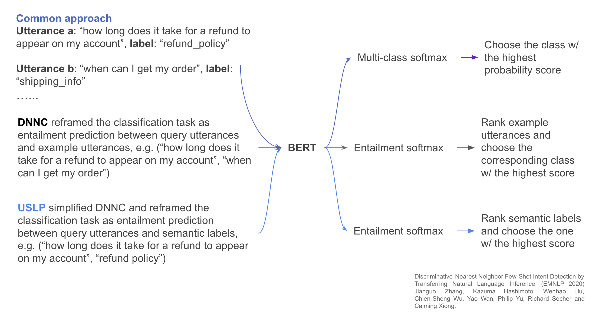
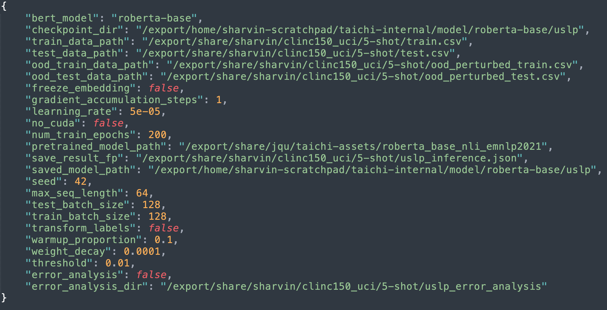
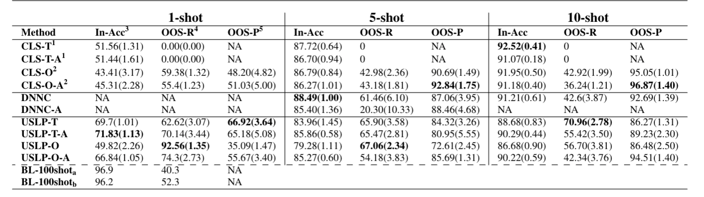

# Taichi Documentation

### High Level Summary

**Why are we doing this?**

1. Large, complex and isolated codebases from existing few shot learning projects (research+product) → it’s a BIG learning curve for new users!
2. Open source libraries for few shot learning are extremely rare...
3. A library with unified, user-friendly and pythonic APIs is desired to empower any Python user to quickly experiment with their own data

**Enter Taichi - An open source Python library for few shot learning**

1. Modular and extensible API design, “*from taichi import few_shot_learning_method”*
2. Two few shot methods have been implemented, USLP + DNNC
3. Supports quick data sampling and error analysis
4. GitHub repo: [_https://github.com/MetaMind/taichi-internal_](https://github.com/MetaMind/taichi-internal)

### High Level Details on Algorithms


1. As explained above, the difference between USLP and DNNC is that USLP reframes the classification task as an entailment prediction between query utterance and semantic label, while DNNC reframes the task as an entailment prediction between query and example utterances
2. The pretraining of the above NLI models is covered [here](https://github.com/salesforce/DNNC-few-shot-intent)
3. The USLP model is typically faster than DNNC in training as number of labels are usually lower than the number of examples

### How to Run the Code

**Data Sampling**

1. The following step imports the Data Pipeline object for quick data sampling
    1. `from taichi.data_pipeline import DataPipeline`
2. The following step sets up the data pipeline object with the dataset name, path and language

    1. `dp = DataPipeline(name=“clinc150”, data_path=“full path to data file in csv or json, edit accordingly”, language=“en_US by default”)`
    2. Expects json data file in the following format:
        1. `{split: list(list containing utterance and label)}`
            1. Example: `{'train':[[utterance1, label1], [utterance2, label2], ... 'test':[[...]]}`
        2. The data format is as found in CLINC150 dataset
    3. Expects csv data file in the following format:
        1. `utterance,language,label (no headers and no index)`
            1. Example: `book a ticket from San Francisco to New York,en_US,Book a Flight`
1. Based on the data file and format received (csv/json), we can subsample the input data file and save it as csv or json in the path (`save_dir`) of our choice
    1. to save to csv, use the following command:
        1. `dp.save_subsampled_data_to_csv(save_dir="/export/share/sharvin/clinc150_uci/1-shot", split='train', n_shot=1, is_json=True, random_state=42,  save_filename="train.csv")`
            1. Here, the default split `train`  (will check for right split name and throw exception in case of incorrect split name; also does not matter if the data source is `csv`) in the `CLINC150` dataset json file (`is_json=True`, False in case of data source being a `csv` ) gets subsampled into `10` samples per class (will check if possible_ and saved in `os.path.join(save_dir, save_filename)`  creating the path if it doesn’t exist in the process as `csv` file in the format mentioned above in 2c
    2. we can save our file as json in much the same way with the following command:
        1. `dp.save_subsampled_data_to_json(save_dir="/export/share/sharvin/clinc150_uci/1-shot", split='train', n_shot=1, is_json=True, random_state=42, orient='records', save_filename="1-shot-train.json")`

**Modifying Config Parameters**

1. We have individual config files containing hyperparameters for USLP and DNNC models. Please find below an example of the config file for USLP (the DNNC config file also has the same parameters):
    
    1. Let us dive deeper into some of the individual parameters and groups of parameters to understand why they are needed
        1. `bert-model` is for the pretrained tokenizer that we will be using to derive features from sequences
        2. `checkpoint_dir` is to save the model after training the model reformulating the classification task as an entailment prediction problem. We use `saved_model_path` for loading the trained model during evaluation. Therefore `checkpoint_dir` and `saved_model_path` are typically the same
        3. `train_data_path`, `test_data_path`, `ood_train_data_path` and `ood_test_data_path` are user defined paths for the model to know where to take the data from. One can see how the `save_dir` during the data sampling is used as input paths for our downstream classification task. One can adjust the paths per one’s convenience
        4. `pretrained_model_path` is self explanatory as we mention the pretrained model path we intend to use to reformulate and train again as an entailment prediction problem
        5. `save_result_fp` is the path to store the inference results in terms of threshold, in-domain accuracy, precision, recall, and f1 macro along with ood-recall in a `json` format
        6. `error_analysis` is a flag to indicate if the user is interested in some quick error analysis where on evaluation, the user can quickly gather where the model made mistakes (misclassifications), see a more detailed classification performance per class (classification report) and see visualizations in the form of confusion matrix for both in-domain and OOD samples. All these files get generated and saved in `error_analysis_dir`
        7. All other hyperparameters mentioned in the config are self explanatory and tweaking them can potentially help users in better performance on their datasets of choice

**Note:** The paths for the model and data (parameters) will have to be modified by the user suitably in the config file to ensure smooth running of the library.


**Run Code End-to-End**

1. Please find a quick snapshot on how the USLP model can be trained as below
    ```python
    from taichi import uslp # import algorithm
    
    uslp_model = uslp.USLP() # instantiate the algorithm class (default config path set to uslp_config.json, user can set custom path)
    
    uslp_model.init() # initialize the data and model
    
    uslp_model.train() # model training
    
    uslp_model.eval() # model evaluation
    ```

1. DNNC has the same easy API signature for training and evaluation
    ```python
    from taichi import dnnc # import algorithm
    
    dnnc_model = dnnc.DNNC() # instantiate the algorithm class (default config path set to dnnc_config.json, user can set custom path)
    
    dnnc_model.init() # initialize the data and model
    
    dnnc_model.train() # model training
    
    dnnc_model.eval() # model evaluation
    ```

**Environment, Data, Model and Hyperparameters Summary**

1. Used torch==1.7.1 AND transformers==4.5.1 **(same as paper)** versions for the experiments on an a100 GPU
2. Used `data_small.json` from [CLINC150](https://github.com/clinc/oos-eval/tree/master/data) for benchmarking
3. Model: `roberta-base` implementation from Huggingface
4. Threshold: 0.01
5. Train Batch Size: 128
6. Num Train Epochs: 200
7. Learning Rate: 5e-5
8. No Data Augmentation

**Results From Paper (*Focus on DNNC and USLP-T*)**


**Results using Taichi Library**

Comparable results for USLP using Taichi to the results presented in the paper (USLP-T) for in-domain F1, OOD-Recall and OOD-Precision. Higher results for DNNC in comparison to results in the paper (DNNC) for in-domain F1 and OOD-Recall with comparable OOD-Precision.

|model	|samples per class	|in-domain F1	|OOD-recall	|OOD-precision	|
|---	|---	|---	|---	|---	|
|USLP	|full	|0.9459	|0.637	|0.947	|
|   |10	|0.892	|0.734	|0.854	|
|   |5	|0.8354	|0.679	|0.857	|
|   |1	|0.6667	|0.629	|0.664	|
|DNNC   |full	|0.9489	|0.25	|0.996	|
|   |10	|0.9203	|0.603	|0.933	|
|   |5	|0.902	|0.789	|0.858	|
|   |1	|NA	|NA	|NA	|

We also compare this with using off-the-shelf BERT model (`bert-base-uncased`) and get the following results:

|model	|samples per class	|in-domain F1	|OOD-recall	|OOD-precision	|
|---	|---	|---	|---	|---	|
|USLP	|full	|0.9446	|0.722	|0.914	|
|   |10	|0.8838	|0.738	|0.836	|
|   |5	|0.8289	|0.772	|0.721	|
|   |1	|0.6526	|0.66	|0.584	|
|DNNC	|full	|0.9258	|0.321	|0.968	|
|   |10	|0.9055	|0.58	|0.898	|
|   |5	|0.8732	|0.737	|0.791	|
|   |1	|NA	|NA	|NA	|

**Important:** Please note that these algorithms (DNNC in particular) are typically designed for and effective in few-shot settings and therefore might face memory issues for larger datasets. For DNNC full-shot experiments, we reduced the number of negative pairs and processed the data in batches during training and inference.

**Testing**

To test if the models work as expected, please run `test_uslp.py` and `test_dnnc.py` which can be found in the `tests` directory.
Please note that the config files (`test_uslp_config.json` and `test_dnnc_config.json`) would have to be altered accordingly to point to the model and data we use to evaluate the tests. For USLP, we run 1-shot experiment on CLINC150 and for DNNC, we run 5-shot experiment on CLINC150.


### References

1. USLP:[Few-Shot Intent Classification by Gauging Entailment Relationship Between Utterance and Semantic Label](https://aclanthology.org/2021.nlp4convai-1.2/)
2. DNNC:[Discriminative Nearest Neighbor Few-Shot Intent Detection by Transferring Natural Language Inference](https://arxiv.org/abs/2010.13009) 
3. [CLINC150 Dataset](https://github.com/clinc/oos-eval/tree/master/data)
